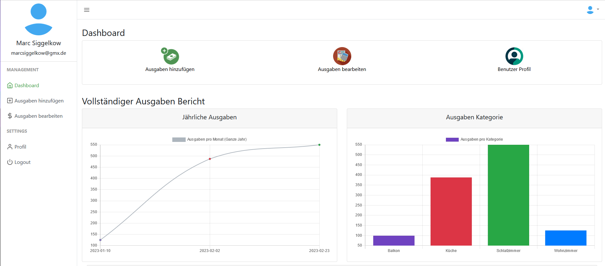
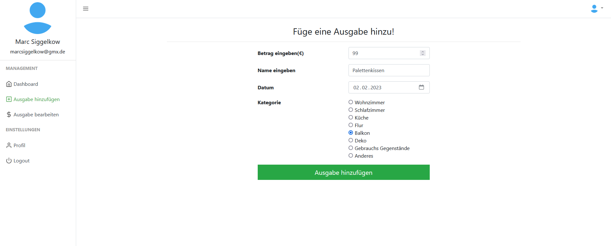
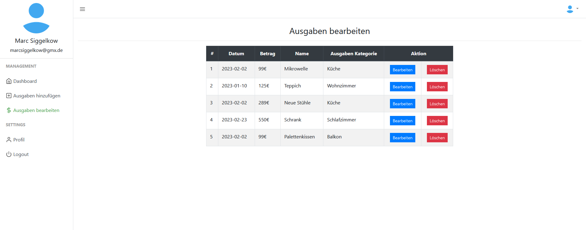

# Ausgaben Manager

Ein kleines Projekt um Ausgaben zu Verwalten und zu Visualisieren.

### Features
+ Man kann sich ein User Account erstellen 
+ Kategorien anlegen
+ Ausgaben hinzufügen
+ Ausgaben entfernen oder bearbeiten
+ Budget festlegen
+ Dashboard
+ Vergleich von Ausgaben per Kategorie und per Monat

## Das Dashboard

## Eine Ausgabe hinzufügen

## Eine Ausgabe bearbeiten

